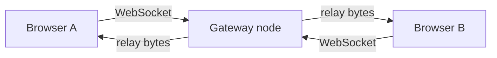
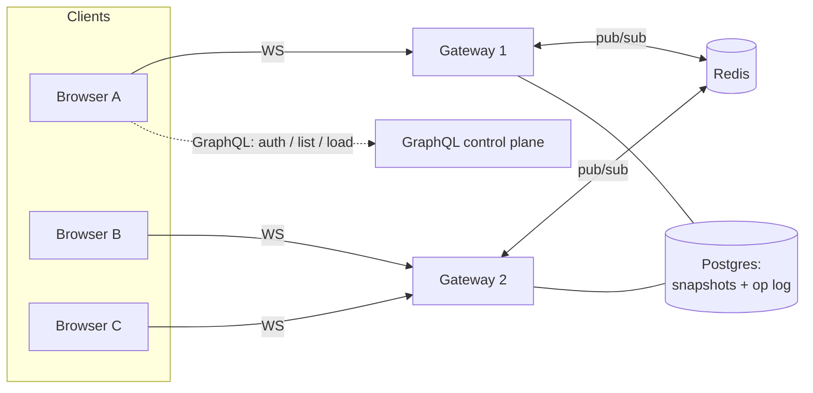

# Architecture

## The problem

One logical whiteboard, many people, and more people than a single process should serve.
The design goal is **horizontal scale**: handle more clients by running more identical
gateway nodes, never by making one node bigger or special.

## Where it is today (single node)

The gateway's `hub` is a content-agnostic byte relay: it tracks which clients are on which
board and forwards each inbound frame to the others. It never parses the drawing protocol.
That is the whole point — the relay boundary is a plain "publish these bytes to this board,"
which is exactly the shape Redis pub/sub takes next.

## Where it's going (N nodes, one board)

An edit arrives at whichever node the client connected to. That node publishes it to the
board's Redis channel; every node subscribed to that channel delivers it to its own local
clients. No node owns the board, so adding replicas just adds capacity.

## Two transports, on purpose

- **Cold path — GraphQL:** sign in, list boards, create a board, load a snapshot. Requests
  that happen rarely and benefit from a typed schema and caching.
- **Hot path — WebSocket:** cursors and strokes, many per second per client. Kept as a lean
  byte relay. See [DECISIONS.md](DECISIONS.md) for why this isn't GraphQL subscriptions.

## State model

- **Op log:** the ordered stream of edits for a board.
- **Snapshot:** a periodic materialization so a late joiner loads current state + a short
  tail instead of replaying everything.
- **CRDT:** per-object last-write-wins so concurrent edits converge without a lock.

## Build steps

1. ✅ Single-node gateway + live canvas (byte relay, ping/pong, best-effort delivery)
2. ✅ Redis pub/sub fan-out — multiple nodes serve one board (`docker compose up`)
3. ✅ Durable board state + cross-node catch-up — op log in Postgres, replayed on
   join via an async batched writer (snapshot compaction is a later optimization)
4. ⬜ GraphQL control plane — auth, list/create, load snapshot
5. ⬜ Per-object CRDT convergence
6. ✅ Kubernetes on `kind` — 3-node cluster, 3 stateless gateway replicas (HPA manifest
   included; needs metrics-server)
7. ✅ k6 load test + published results — see [loadtest/RESULTS.md](loadtest/RESULTS.md)
8. 🔧 Finishing kit — React UI ✅ · ADRs ✅ · hero screenshot ✅ · two-node gif still to record
