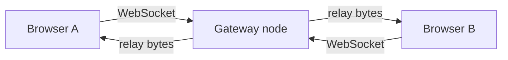
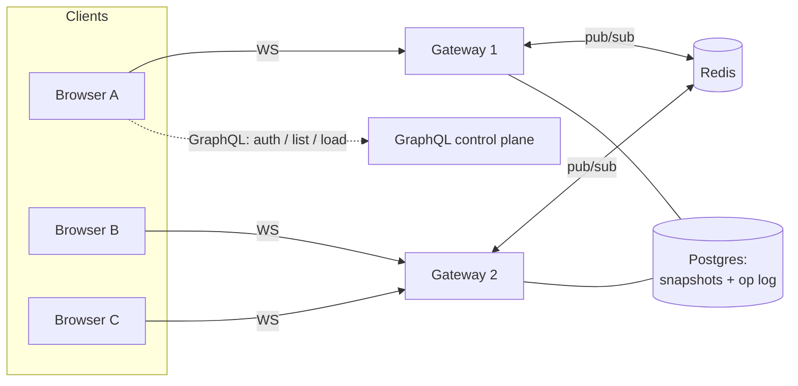

# Architecture

## The problem

One logical whiteboard, many people, and more people than a single process should serve.
The design goal is **horizontal scale**: handle more clients by running more identical
gateway nodes, never by making one node bigger or special.

## Where it is today (single node)

The gateway's `hub` is a content-agnostic byte relay: it tracks which clients are on which
board and forwards each inbound frame to the others. It never parses the drawing protocol.
That is the whole point. The relay boundary is a plain "publish these bytes to this board,"
which is exactly the shape Redis pub/sub takes next.

## Where it's going (N nodes, one board)

An edit arrives at whichever node the client connected to. That node publishes it to the
board's Redis channel; every node subscribed to that channel delivers it to its own local
clients. No node owns the board, so adding replicas just adds capacity.

## Two transports, on purpose

- **Cold path (GraphQL):** list boards, create a board: rare, typed calls that benefit
  from a schema. Built as a gqlgen federation subgraph at `/graphql`; the lobby is its
  client. See [GRAPHQL.md](GRAPHQL.md).
- **Hot path (WebSocket):** cursors and strokes, many per second per client. Kept as a lean
  byte relay. See [DECISIONS.md](DECISIONS.md) for why this isn't GraphQL subscriptions.

## State model

- **Op log:** the ordered stream of edits for a board, each an id'd operation (`add` an
  object, `erase` objects, `clear`). Relayed to peers and appended per board; a late joiner
  replays it to reach the current board. The client holds the board as a retained scene of
  objects and draws it through a pan/zoom lens (so it survives resize and scales infinitely).
- **Snapshot:** a periodic materialization so a late joiner loads current state + a short
  tail instead of replaying everything. *(planned optimization)*
- **CRDT:** per-object last-write-wins so two people editing the *same* object converge
  without a lock. *(planned, step 5)*

## Build steps

1. ✅ Single-node gateway + live canvas (byte relay, ping/pong, best-effort delivery)
2. ✅ Redis pub/sub fan-out: multiple nodes serve one board (`docker compose up`)
3. ✅ Durable board state + cross-node catch-up: op log in Postgres, replayed on
   join via an async batched writer (snapshot compaction is a later optimization)
4. ✅ GraphQL control plane: list/create boards, served as a gqlgen **federation
   subgraph** at `/graphql`; the lobby is its client (see [GRAPHQL.md](GRAPHQL.md)).
   No accounts by design.
5. ⬜ Per-object CRDT convergence
6. ✅ Kubernetes on `kind`: 3-node cluster, 3 stateless gateway replicas (HPA manifest
   included; needs metrics-server)
7. ✅ k6 load test + published results: see [loadtest/RESULTS.md](loadtest/RESULTS.md)
8. ✅ Diagram canvas (React + TypeScript), a retained scene drawn through a pan/zoom
   lens: shapes, edge-snapping connectors, freehand, and an eraser; infinite zoom/pan;
   survives resize; in a documented design system (see [DESIGN.md](DESIGN.md))
9. ✅ One-command production deploy: the whole stack on one host behind Caddy with
   automatic HTTPS (see [`deploy/prod`](deploy/prod))
10. 🔧 Finishing kit: ADRs ✅ · screenshots ✅ · load test ✅; a two-node collaboration
    gif is the last polish
