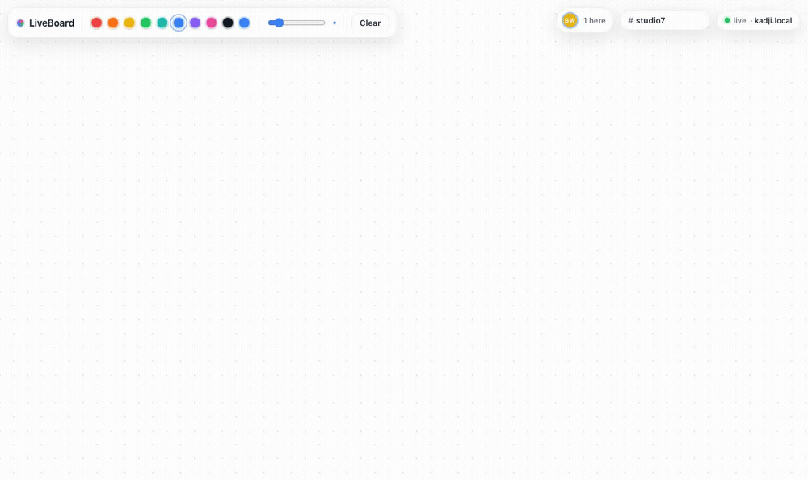

# LiveBoard

A real-time collaborative whiteboard built to scale **horizontally**: any number of
stateless gateway nodes serve one shared board, and an edit made on one node reaches
everyone on every other node.



**Measured on a local 3-node `kind` cluster (a single 2-CPU VM, $0 cloud):** 500 concurrent
WebSocket clients held at **p95 34 ms · p99 66 ms broadcast latency, zero errors**. The gateway
accepts **3,000 concurrent connections with zero connection errors**; latency then grows as the
2-CPU VM saturates — fan-out is CPU-bound, and the stateless design scales out with more cores.
Full method, numbers, and bottleneck analysis: **[loadtest/RESULTS.md](loadtest/RESULTS.md)**.

## Why it's interesting

- **Stateless fan-out.** Gateway nodes hold no authoritative state. Membership and
  cross-node delivery run through Redis pub/sub, so you scale by adding replicas — no
  sticky sessions, no node is special.
- **Two transports on purpose.** GraphQL handles the cold path (sign in, list boards,
  load a snapshot). Raw WebSocket handles the hot path (cursors and strokes at pointer
  speed). The [decision doc](DECISIONS.md) explains why the 60fps stream does **not** go
  through GraphQL subscriptions.
- **Convergence, not locking.** Concurrent edits resolve with a per-object last-write-wins
  CRDT, so two people editing the same shape end up in the same state without a coordinator.
- **Fast catch-up.** A late joiner loads a snapshot plus the tail of an op log instead of
  replaying all of history.

## Stack

Go (WebSocket gateway) · Redis (pub/sub + presence) · Postgres (snapshots + op log) ·
GraphQL (control plane) · React + Canvas (client) · Kubernetes on `kind` · k6 (load test).

## Quick start (single node)

Needs Go, Node, and a browser.

```bash
make dev          # builds the React UI, then serves it + the gateway on :8080
```

Open **http://localhost:8080** in two browser windows, keep the board name the same, and
draw — strokes, cursors, and presence sync live.

## See it scale across nodes

Needs Docker. Brings up **two interchangeable gateway nodes + Redis + a load balancer**:

```bash
docker compose up --build     # http://localhost:8080
```

Open the URL in two windows. The load balancer round-robins them onto **different nodes**
(the corner shows `node gw1` / `node gw2`), yet they draw on the **same board** — an edit on
one node reaches clients on the other through Redis. No sticky sessions, no special node.

Boards are **durable and shared**: refresh, or join late on the other node, and the drawing
is still there — it's replayed from Postgres. Cursors stay transient (never stored).

Prove both without a browser:

```bash
go run loadtest/xnode_check.go    # live sync crosses nodes
# PASS: a stroke on node gw1 reached a client on node gw2

go run loadtest/catchup_check.go  # history survives across nodes + reconnect
# PASS: a stroke drawn on gw1 replayed to a fresh client on gw2
```

## Status

See the [build steps in ARCHITECTURE.md](ARCHITECTURE.md#build-steps).
Working today: multi-node fan-out (Redis), durable cross-node catch-up (Postgres),
Kubernetes on `kind`, and a [published load test](loadtest/RESULTS.md).
Next: a GraphQL control plane (accounts, board list) and a React UI.

## License

MIT — see [LICENSE](LICENSE).
